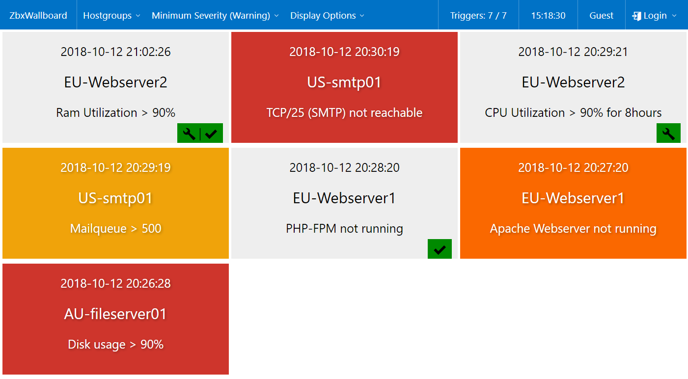
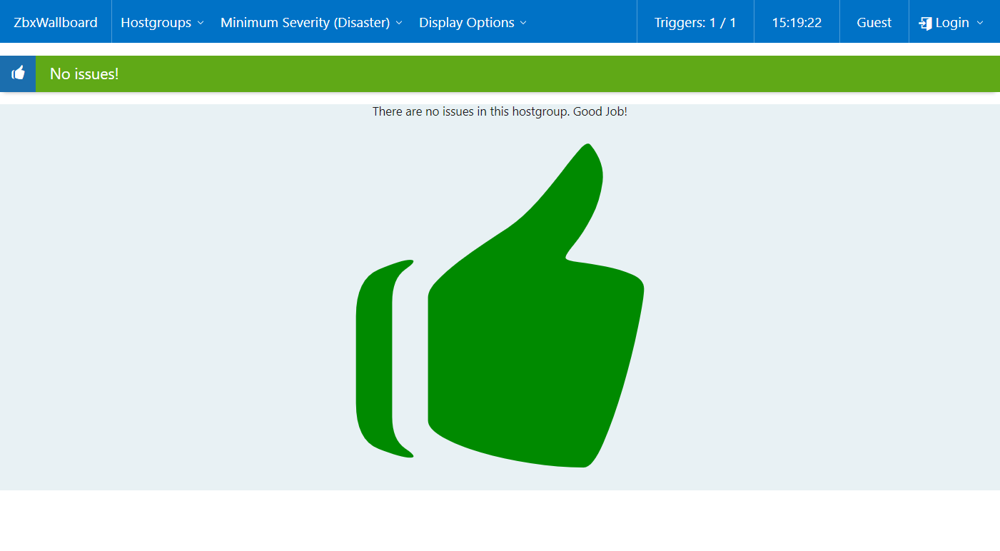
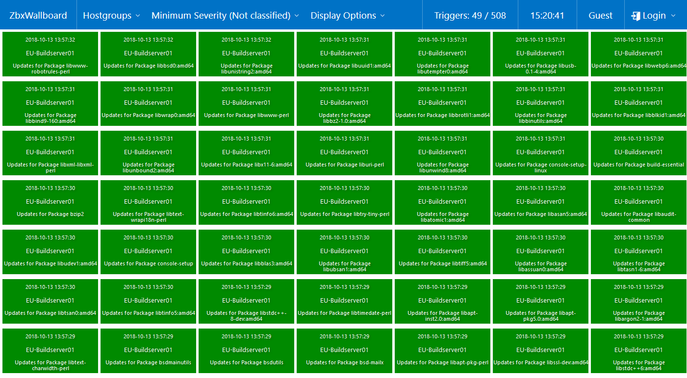

# ZbxWallboard

## Description
This tool allows you to build a Wallboard with all active triggers/problems. 
No tables. No small texts. It's used to get an overview from distance.

Use big screen in the office and load the wallboard there. All people in the office could see the problems without keep Zabbix open on the own screen.

## Features
* Overview about active triggers/problems
* Filter by hostgroup and severity
* Display option to hide acknowledged or maintenances
* configurable max count of problems
* acknowledgement of active triggers/problems
* very important: lunch reminder :D

# Installation
* Download
* Unpack
* rename config.php.example to config.php
* modify API credentials in config.php and maybe some other things. :)

# Known Issues
* Acknowledge adding is prepared for Zabbix 4.x
** not working with Zabbix < v4.0 any more
** works only for first message with ack-flag

# Additional Screenshots

