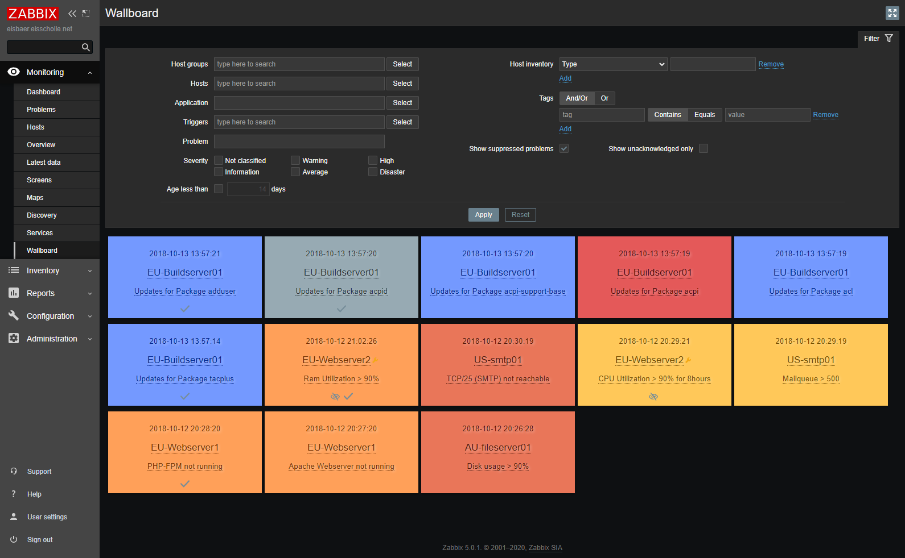

# ZbxWallboard

## Description
This tool allows you to build a Wallboard with all active triggers/problems. 
No tables. No small texts. It's used to get an overview from distance.

Use big screen in the office and load the wallboard there. All people in the office could see the problems without keep Zabbix open on the own screen.

## Variants
### Zabbix UI Module

[Take a look ...](module/README.md)

### Standalone
> **_NOTE:_**  This variant is discontinued.

[Take a look ...](standalone/README.md)

